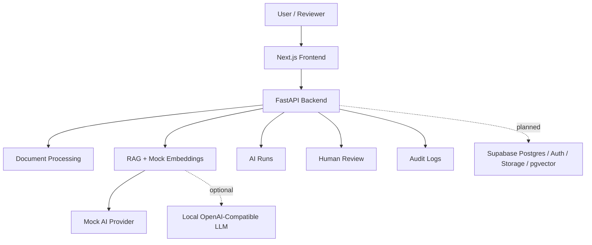

# AI Workflow Command Center

## Overview

AI Workflow Command Center is a production-style portfolio project for managing AI-assisted document workflows: document ingestion, RAG search, AI runs, human review, and audit logs.

It is intentionally not a generic chatbot. The app is framed as an internal operations tool where teams upload or select documents, inspect extracted chunks, ask grounded questions, route AI output through human review, and preserve traceable audit evidence.

## Why I Built This

I built this to demonstrate practical AI workflow engineering without using private company code, prompts, screenshots, workflows, or data. The project proves how AI can be integrated into a real product flow with grounding, review, role-aware UX, and production-minded trade-offs.

Representative real-world use cases include vendor intake review, policy Q&A, incident report summarization, customer escalation briefing, and compliance preparation.

## Live Demo

- Live demo: `TODO: add deployed Vercel URL`
- Backend API: `TODO: add deployed FastAPI URL`
- Demo mode: mock AI by default, no paid provider key required

## Screenshots

Add screenshots after deployment or local capture:

- `TODO`: Dashboard metrics
- `TODO`: Document detail and processing pipeline
- `TODO`: RAG answer with source snippets and retrieval evidence
- `TODO`: Review decision panel
- `TODO`: Audit log with linked evidence

## Key Features

- Demo login with HTTP-only mock session cookie
- Protected dashboard routes
- Seeded document list/detail pages with extracted chunks
- Upload metadata validation API and UI
- Deterministic document processing pipeline with completed and blocked states
- Deterministic mock embedding pipeline with retrieval diagnostics
- RAG index status API/UI evidence with vector previews
- Mock RAG query API and frontend with source snippets
- AI run history API and frontend detail views
- Document Intake Review workflow API and tool-step page
- Human review queue and decision API
- Local review decision panel with reviewer note validation and audit event preview
- Audit log API and frontend event trail linked back to workflow evidence
- Dashboard metrics computed from seeded demo data
- Supabase schema scaffold with pgvector, RLS policies, and synthetic seed SQL

## Architecture

The MVP uses a Next.js + TypeScript frontend and a single FastAPI backend. Supabase Postgres, pgvector, Auth, and Storage are the planned free-demo persistence layer. Mock AI mode is the public default, with optional OpenAI/Claude keys or an OpenAI-compatible local LLM server such as LM Studio for local evaluation.



More detail: `docs/architecture.md` and `docs/architecture-decisions.md`.

## Tech Stack

- Frontend: Next.js, React, TypeScript, Tailwind CSS
- Backend: FastAPI as the single MVP backend
- Database plan: Supabase Postgres
- Vector search plan: Supabase pgvector
- Auth plan: Supabase Auth
- Storage plan: Supabase Storage
- AI: mock AI mode by default, optional OpenAI/Claude or local OpenAI-compatible LLM mode
- CI/CD: GitHub Actions
- Deployment plan: Vercel frontend, free/near-free FastAPI backend host, Supabase

## Core AI Workflow

1. Select or register a synthetic document.
2. Validate metadata and processing readiness.
3. Show deterministic extraction/chunking stages.
4. Generate deterministic mock embeddings.
5. Retrieve relevant chunks for a RAG question.
6. Return a grounded answer with source snippets, matched terms, embedding IDs, and retrieval reasons.
7. Store the result shape as an AI run.
8. Route high-impact output to human review.
9. Capture review decisions and audit events.

## Data Model

The Supabase scaffold includes:

- `profiles`
- `documents`
- `document_chunks`
- `ai_runs`
- `ai_run_sources`
- `reviews`
- `audit_logs`

See `supabase/migrations/0001_initial_schema.sql` for the planned schema, pgvector column, indexes, and RLS policies.

## API Overview

Implemented local/mock APIs include:

- `GET /api/health`
- `GET /api/auth/session`
- `GET /api/config/status`
- `GET /api/ai/providers/status`
- `GET /api/dashboard/metrics`
- `GET /api/documents`
- `POST /api/documents`
- `GET /api/documents/{id}`
- `POST /api/documents/{id}/process`
- `GET /api/rag/index`
- `POST /api/rag/query`
- `GET /api/ai-runs`
- `GET /api/ai-runs/{id}`
- `POST /api/workflows/document-intake`
- `GET /api/reviews`
- `POST /api/reviews/{id}/decision`
- `GET /api/audit-logs`

See `docs/api.md` for request/response expectations.

## Current Local Phase Boundary

Phase 2 is complete for local/mock mode: the app can register upload metadata, show seeded document detail, expose deterministic processing stages, show extracted chunks, and document the Supabase persistence path. Real file storage, persisted document rows, background jobs, and pgvector writes require Supabase project credentials.

Phase 3 is complete for local/mock mode: the app can generate deterministic mock embeddings, expose RAG index readiness, retrieve grounded source snippets, show matched terms and embedding IDs, store AI run-shaped records, and demonstrate no-context fallback behavior. Real OpenAI/Anthropic/local LLM generation requires provider configuration and a selected model.

Phase 4 is complete for local/mock mode: the app can show review queue state, validate local reviewer decisions, preview the audit event that would be written, reject repeat decisions in the backend API, and link audit events back to workflow evidence. Persisted review decisions and durable audit writes require Supabase credentials.

## Local Setup

Copy environment placeholders:

```bash
cp .env.example .env
```

Install frontend dependencies:

```bash
npm install
```

Create and install backend dependencies:

```bash
cd apps/api
python -m venv .venv
.venv\Scripts\activate
python -m pip install -e ".[dev]"
```

On macOS/Linux, activate the backend environment with:

```bash
source .venv/bin/activate
```

Run the frontend:

```bash
npm run dev:web
```

Run the backend:

```bash
npm run dev:api
```

Open `http://localhost:3000`, continue as Demo Admin, then use the dashboard navigation.

## Local Supabase

The Supabase CLI is installed as a project dev dependency. Start Docker Desktop first, then use:

```bash
npm run supabase:start
npm run supabase:status
npm run supabase:reset
```

The wrapper in `scripts/run-supabase.mjs` keeps Supabase CLI runtime files inside the repo-local ignored `.supabase/` folder so commands do not need to write telemetry files into your Windows home directory.

## Environment Variables

The public local demo works with empty Supabase and provider keys. Keep `.env` private and commit only `.env.example`.

Important variables:

- `NEXT_PUBLIC_APP_URL`
- `NEXT_PUBLIC_SUPABASE_URL`
- `NEXT_PUBLIC_SUPABASE_ANON_KEY`
- `SUPABASE_SERVICE_ROLE_KEY`
- `API_BASE_URL`
- `AI_MODE`
- `OPENAI_API_KEY`
- `ANTHROPIC_API_KEY`
- `LOCAL_LLM_BASE_URL`
- `LOCAL_LLM_MODEL`
- `JWT_SECRET`

## Demo Path

1. Login at `/login`.
2. Open `/dashboard` and review computed metrics.
3. Open `/documents/doc_vendor_intake` and inspect extracted chunks.
4. Open `/documents/doc_vendor_intake/processing` and show the processing stages.
5. Ask a grounded question in `/rag` and inspect matched terms, embedding IDs, and vector previews.
6. Inspect stored AI run details in `/ai-runs` and verify retrieved context metadata.
7. Open `/workflows/document-intake` and review the tool-call sequence.
8. Open `/reviews/review_vendor_risk_summary` and submit a local reviewer decision.
9. Open `/audit-logs` and follow links back to workflow evidence.

## Testing

```bash
npm run format:check
npm run typecheck
npm run lint
npm run test
npm run build
```

These commands require dependencies to be installed first.

Known local note: if `next dev` is running while `next build` runs, clear or restart the dev server if stale `_next` assets appear in the browser.

## Security Considerations

- Uses synthetic demo data only.
- Public demo defaults to mock AI mode.
- No API keys, service-role keys, or `.env` files should be committed.
- Upload metadata validation restricts type and size.
- Protected frontend routes require the demo session cookie.
- Review and audit flows are designed for Reviewer/Admin enforcement when Supabase Auth is wired.
- RAG answers show source snippets and retrieval evidence.
- Prompt injection risks are documented in `docs/security-notes.md`.

## Deployment

Planned free-demo deployment:

- Frontend: Vercel
- Backend: free/near-free FastAPI host
- Database/Auth/Storage/vector: Supabase
- CI: GitHub Actions
- AI: mock mode by default; optional evaluator-provided key or local model for non-public testing

## Trade-Offs

- Uses a single FastAPI backend to keep the MVP understandable and deployable.
- Uses deterministic mock AI and embeddings so the public demo has no secret or cost risk.
- Uses seeded local data until Supabase credentials are provided.
- Uses client-side local decision previews for demo UX while backend decision APIs already model the durable shape.
- Defers background queues, durable file storage, real pgvector writes, and real provider calls until credentials/infrastructure are available.

## Production Upgrade Path

- Move document processing to background workers with retries and dead-letter handling.
- Persist uploads in object storage and chunks/embeddings in Postgres/pgvector.
- Replace mock providers with OpenAI, Anthropic, Azure OpenAI, Bedrock, or a secured local provider.
- Add request IDs, structured logs, tracing, metrics, and alerting.
- Enforce Supabase Auth/RLS or enterprise identity with stricter role policies.
- Add evaluation datasets for RAG source quality and hallucination regression checks.

## Future Improvements

- Real Supabase Auth/Storage/Postgres integration
- Background jobs for document processing
- Persisted review decisions and audit rows
- Local LLM execution via LM Studio once a model is selected
- Deployment previews and screenshots
- OpenTelemetry traces
- Prompt injection test fixtures
- Data retention and deletion workflow
- Reviewer assignment and escalation rules

## Interview Notes

See `docs/interview-talking-points.md` for concise explanations of the architecture, RAG flow, safety posture, scaling path, and AWS migration story.
