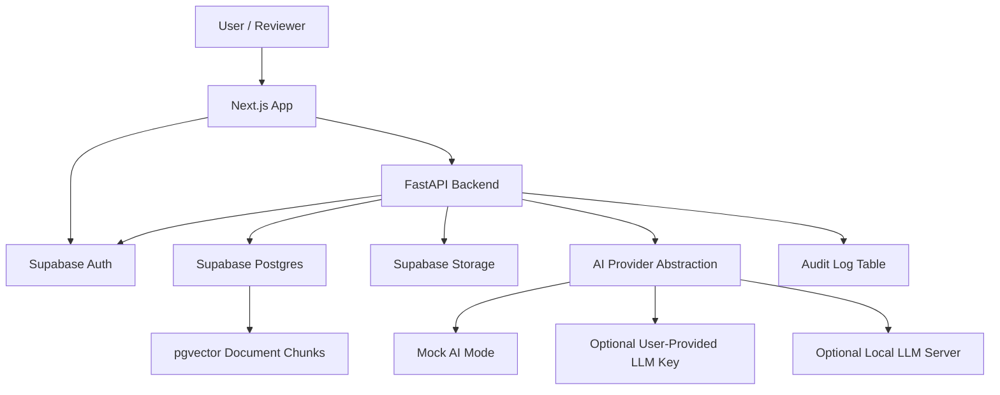
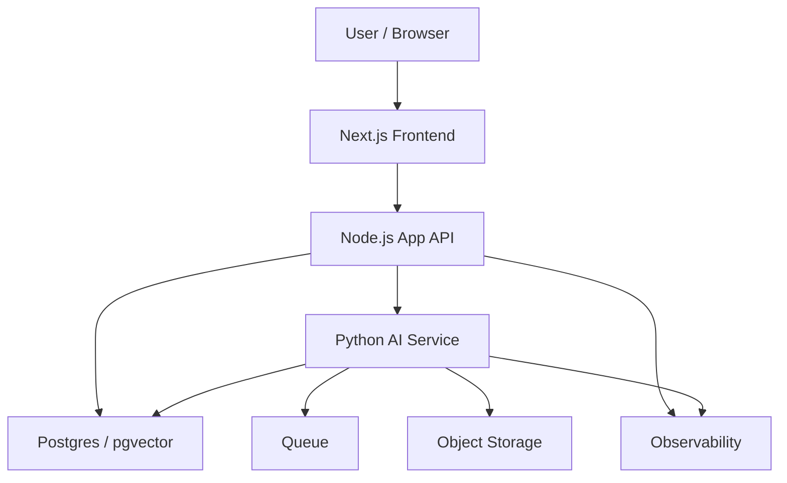

# Architecture

## Overview

AI Workflow Command Center is a portfolio demo for managing AI-assisted document workflows. The system ingests documents, chunks and indexes text, answers grounded questions with RAG, routes AI outputs to human review, and records audit events.

The MVP uses a Next.js + TypeScript frontend, one FastAPI backend, Supabase Postgres with pgvector, Supabase Auth, Supabase Storage, and mock AI mode by default. Local evaluators may optionally provide an OpenAI/Claude key or use an OpenAI-compatible local LLM server such as LM Studio.

The architecture mirrors real internal AI platforms: user-facing workflow screens, authenticated APIs, durable document metadata, retrievable chunks, AI run records, review state, and audit events. The demo intentionally uses free-tier services, but the boundaries are chosen so each part can be replaced with production infrastructure later.

## Demo Architecture

## Core Modules

- `documents`: manages document metadata, storage references, processing status, and chunks.
- `rag`: retrieves relevant chunks and generates grounded answers with source snippets.
- `ai-runs`: stores AI inputs, outputs, provider metadata, retrieved context, and status.
- `reviews`: manages pending AI outputs and reviewer decisions.
- `audit`: records important user, document, AI, review, and error events.
- `auth`: protects dashboard routes and enforces Admin/Reviewer capabilities.

## Real-World Workflow Fit

This architecture fits document-heavy internal workflows such as:

- Vendor intake and risk review
- Policy Q&A with source grounding
- Incident report summarization
- Customer escalation brief generation
- Quarterly operations report analysis
- Compliance or audit preparation workflows

The shared pattern is the same: ingest source material, retrieve relevant evidence, generate a draft, route it for review, and preserve an audit trail.

## Data Flow

1. A user uploads or selects a seeded document.
2. The backend extracts text, chunks content, and stores chunks.
3. Embeddings are generated or mocked depending on demo mode.
4. RAG queries retrieve relevant chunks and produce sourced answers.
5. The Document Intake Review workflow creates an AI summary and risk assessment.
6. The output is sent to the review queue.
7. A reviewer approves, rejects, or requests changes.
8. Audit logs record the important actions.

## Demo Trade-Offs

- Free-tier infrastructure is used for accessibility and low operating cost.
- Background jobs may be simplified to synchronous processing or manual triggers.
- Mock AI mode is acceptable for public demos to avoid exposing paid API keys.
- Local LLM mode is useful for offline or cost-controlled local development, but should not be required for the deployed demo.
- Observability is limited to application logs and audit tables.

## Operational Considerations

- Long-running document processing should eventually move to a queue with retries and dead-letter handling.
- AI provider calls should have timeouts, retry limits, rate-limit handling, and graceful fallback states.
- Local LLM calls should be treated like any other provider: unavailable server, missing model, slow response, and malformed output must have clear failure states.
- Audit logs should be append-only in production and protected from ordinary user edits.
- Uploaded files should have retention policies, deletion behavior, and malware scanning in production.
- RAG quality should be evaluated with representative questions, expected sources, and regression fixtures.
- Production deployments should include request IDs, structured logs, metrics, traces, and alerting.

## Production Upgrade Path

For a production system, move toward dedicated backend services, object storage, managed queues, stronger monitoring, enterprise identity, and infrastructure as code.

## Architectural Decision: Single Backend for MVP

### Context

The project needs to demonstrate production-style AI workflow engineering while remaining small enough to finish, deploy, and review as a public portfolio demo.

### Decision

The MVP uses a single FastAPI backend instead of separate Node.js and Python services. This keeps the free public demo simple, easier to deploy, and easier to review while still demonstrating production-style API design, authentication, document workflows, RAG, audit logs, and AI orchestration.

### Why

FastAPI is a strong fit for document processing, embeddings, RAG, and AI orchestration while still providing clean typed API boundaries. A single backend avoids premature service splitting and keeps the implementation focused on a complete MVP.

### Trade-offs

- Improves implementation speed, deployment simplicity, and reviewer clarity.
- Sacrifices the separation a larger product might want between dashboard APIs and AI processing services.
- Defers independent scaling of product APIs and AI workloads.

### Production Upgrade Path

In a production environment, the system could be split into a Node.js backend-for-frontend and a Python AI service. The Node.js service would handle product APIs, user workflows, and dashboard-specific aggregation, while the Python service would handle document processing, embeddings, RAG, agent workflows, and AI evaluation pipelines.

This separation is deferred until there is enough scale or team complexity to justify the added operational overhead.

This production upgrade path shows the interview-ready evolution without adding implementation risk to the MVP.
