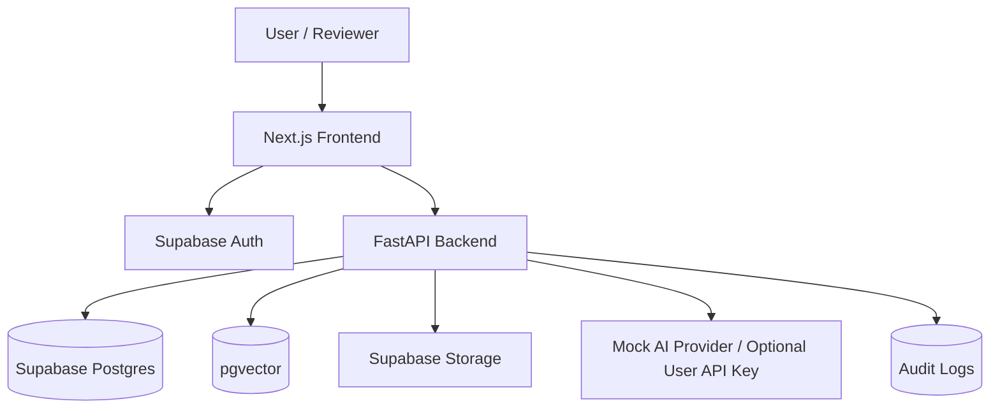
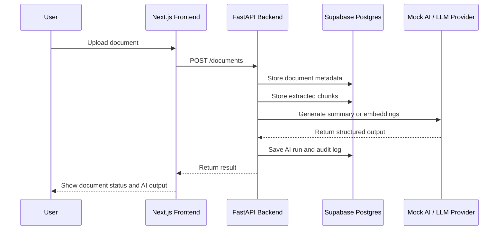

# Architecture Diagrams Skill

## Purpose

Produce clear architecture documentation with diagrams that explain how the system works, why decisions were made, and how the free-demo architecture would evolve into a production-grade architecture.

The output should help technical reviewers quickly understand the project without reading the entire codebase.

## Required Outputs

When documenting architecture, include:

- A short plain-English overview.
- A Mermaid diagram.
- A step-by-step flow explanation.
- Key architectural decisions.
- Trade-offs and limitations.
- Production upgrade path where relevant.

## Preferred Diagram Types

Use Mermaid diagrams in Markdown.

### System Architecture

Use `flowchart TD` to show major components:

- User / Browser
- Next.js frontend
- FastAPI backend
- Supabase Auth
- Supabase Postgres
- pgvector
- Supabase Storage
- Mock AI provider / optional LLM provider
- Audit logs

### Request Flow

Use `sequenceDiagram` to show user actions such as:

- Login
- Upload document
- Run RAG query
- Submit human review
- View audit log

### Data Model

Use `erDiagram` for core database entities.

Include entities such as:

- `users`
- `documents`
- `document_chunks`
- `ai_runs`
- `review_items`
- `audit_logs`

### Deployment

Use `flowchart TD` to show free-demo deployment:

- Vercel
- FastAPI free/near-free backend host
- Supabase
- GitHub Actions
- Optional external LLM provider

## Diagram Rules

- Keep diagrams simple and readable.
- Do not include more than 10 major nodes in one diagram.
- Use clear labels.
- Do not create giant diagrams that try to show everything.
- Prefer multiple small diagrams over one complex diagram.
- Follow every diagram with a short explanation.
- Match diagrams to the actual implemented architecture.
- Do not invent services that are not used.
- If showing a production version, clearly label it as `Production Upgrade Path`.

## Required Architecture Documents

Maintain or update these files when relevant:

- `/docs/architecture.md`
- `/docs/api.md`
- `/docs/free-demo-decision.md`
- `/docs/project-harness.md`

## Architecture Decision Format

When documenting a decision, use this format:

```md
## Architectural Decision: <Decision Name>

### Context

Explain the problem or constraint.

### Decision

State the chosen approach.

### Why

Explain why this approach was chosen.

### Trade-offs

List what this improves and what it sacrifices.

### Production Upgrade Path

Explain how this would change in a real production environment.
```

## Free-Demo Architecture Rule

The public demo must remain free or near-free to operate.

Do not introduce paid infrastructure in architecture diagrams unless the section is clearly marked as `Production Upgrade Path`.

The free-demo architecture should prefer:

- Vercel
- FastAPI backend on a free/near-free host
- Supabase
- Supabase Auth
- Supabase Postgres
- pgvector
- Supabase Storage
- Mock AI mode
- User-provided API key mode
- GitHub Actions

## Production Architecture Rule

When describing production architecture, explain the optimal choice and why.

Common production upgrades:

- Supabase Postgres to AWS RDS or Aurora PostgreSQL
- Supabase Storage to AWS S3
- Free hosting to AWS ECS/Fargate, Lambda, or Kubernetes
- Basic logs to OpenTelemetry, CloudWatch, Datadog, Sentry, or Grafana
- Manual jobs to SQS, Celery, BullMQ, or Temporal
- Mock AI to OpenAI, Anthropic, Azure OpenAI, or AWS Bedrock
- Basic auth to Auth0, Cognito, or enterprise SSO

## Quality Checklist

Before completing an architecture documentation task, verify:

- The diagram renders as valid Mermaid.
- The explanation matches the diagram.
- The free-demo limitations are clear.
- The production upgrade path is clearly separated.
- No paid service is added to the free-demo architecture.
- No private company data, NDA-protected workflow, or proprietary system is referenced.
- The documentation helps the portfolio reviewer understand the engineering value.

## Example System Diagram



## Example Request Flow



## Completion Response Format

When finishing architecture work, summarize:

- Files updated.
- Diagrams added.
- Decisions documented.
- Assumptions made.
- Remaining gaps.
